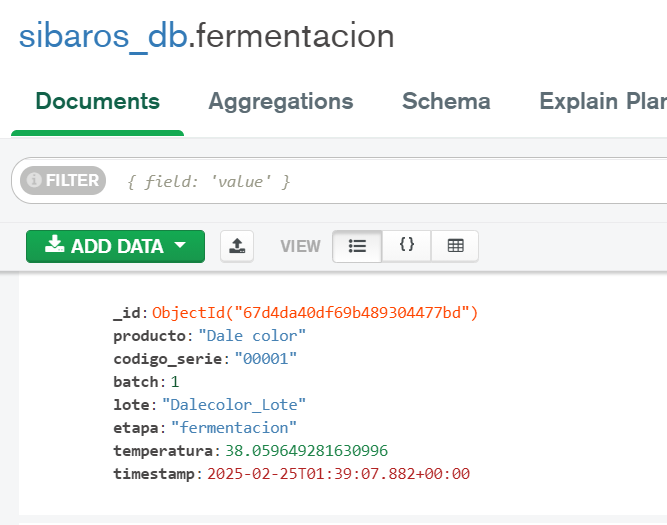
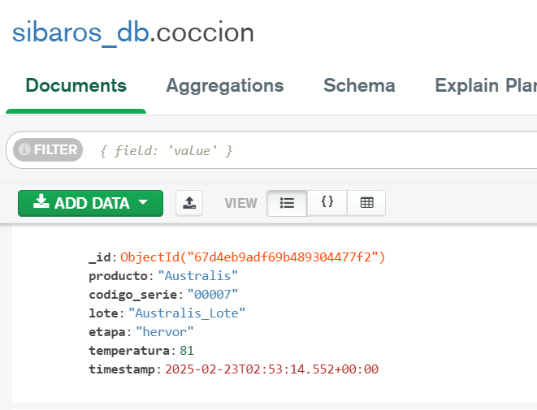

# Proyecto Dashboard

Este es un proyecto de dashboard interactivo, donde puedes visualizar datos y ejecutar diferentes funcionalidades. A continuación, se detallan los pasos necesarios para ejecutar este proyecto en tu máquina local.

## Requisitos

1. **Python**: Asegúrate de tener Python 3.6 o superior instalado en tu sistema.

## Pasos de Instalación

1. **Instalar Python**:
   Si aún no tienes Python, puedes descargarlo desde [python.org](https://www.python.org/downloads/).

2. **Crear un entorno virtual**:
   Para asegurarte de que las dependencias no afecten a otros proyectos en tu máquina, se recomienda crear un entorno virtual. En tu terminal, navega al directorio donde está el proyecto y ejecuta:
   ```bash
   python -m venv venv

3. **Activar el entorno virtual**:
- **Windows**:
  ```bash
     python -m venv venv
     venv\Scripts\activate

4. **Ejecutar la aplicación**:
   ```bash
      python app.py

## Funcionalidades principales
   1. El usuario puede modificar el producto y código de serie

      **Para la sección de fermentación**

      

      La pantalla mostrará NaN y la barra de temperatura vacia hasta que se ingrese a la base de datos información de ese Producto, Código de serie y Lote

      

      Cada docuemento con la temperatura que se ingrese a la base de datos debe tener este esquema. La aplicación no inserta datos de temperatura. Se debe hacer externamente.

      


      **Para la sección de estanques de cocción, es lo mismo.**
      
      

      
      


   2. El usuario puede visualizar le histórico de las temperaturas.

      **Para la sección de fermentación**

      Se debe seleccionar un rango de fecha y el batch. La visualización es de los productos que están activos en los batch.

      


      **Para la sección de estanques de cocción, es lo mismo.**
      
      Se debe seleccionar un rango de fecha y el estanque. La visualización es de los productos que están activos en los estanques de coccion.
      
      


3. Generación de reportes.

   El usuario debe ingresar un código de serie que exista en las bases de datos antes mostradas.
   
      

   Sólo se peude ingresar una imagen y una nota. Además de comentarios.

      

   Para imprimir el reporte, simplemente se hace imprimir en el explorador.

      


## Estructura de Archivos

```plaintext
dashboard/
├── static/
│   ├── css/
│   │   └── styles.css
│   ├── images/
│   └── js/
│       └── scripts.js
├── templates/
│   └── dashboard/
│       ├── components/
│       │   ├── cooking/
│       │   ├── fermentation/
│       │   ├── filtros_coccion/
│       │   ├── filtros_fermentacion/
│       │   ├── generar_reportes/
│       │   ├── reporte/
│       │   └── reporte_imprimir/
│       └── home/
├── routes.py
└── app.py


